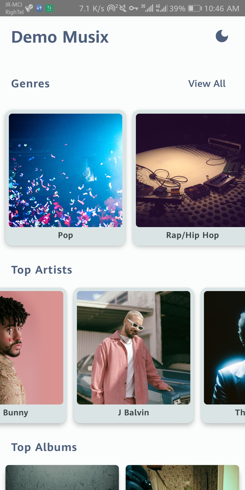

<h1 align="center"><b>DemoMusix</b></h1>

---
# What is DemoMusix?
 

    
    
    

    
View More Screenshots

    

        
        
        
    

    

        
        
    

DemoMusix, the Spotify-inspired music app leveraging Deezer's REST API. Discover a vast collection of genres, artists, albums and songs with 30-second previews. Unleash the power of limitless musical possibilities in the palm of your hand. Download now and let the melody unfold!

Or get the latest APK from the [Releases Section](https://github.com/NimaKhajehpour/DemoMusix/releases/latest).
